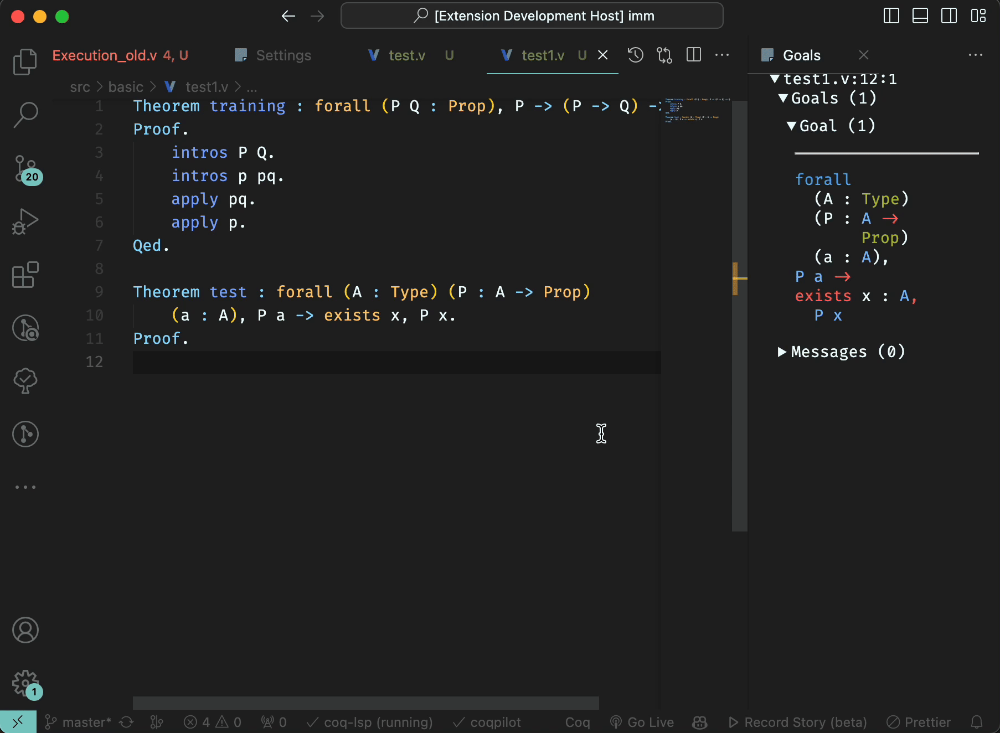

# coqpilot

`Coqpilot` is a [Visual Studio Code](https://code.visualstudio.com/) extension that is designed to help automate writing of Coq proofs. It uses Large Language Models to generate multiple potential proofs and then uses [coq-lsp](https://github.com/ejgallego/coq-lsp) to typecheck them. It substitutes the proof in the editor only if a valid proof is found. 

Now `coqpilot` is in early beta and seeks for feedbacks. Please feel free to open an issue regarding any problem you encounter or any feature you want to see in the future. 

## Brief technical overview

`Coqpilot` now supports fetching proofs from all [open-ai](https://openai.com) gpt models, but is designed to be easily extensible to other models.  

## Features

`Coqpilot` could be run to analyse the opened `coq` file, fetch proofs of successfully typechecked theorems inside it, parse them and use as a message history to present to LLM.

Later on, on demand, it could perform a request to an LLM with an admitted theorem and a message history and get a list of potential proofs. It then uses `coq-lsp` to typecheck them and substitute the first valid proof in the editor.

User can:
- Run `coqpilot` at a given cursor point inside theorem to try substitute the current goal.

 

## Requirements

* `coq-lsp` version 0.1.7 is currently required to run the extension.

## Coq-lsp installation

To make the extension running you will have to install `coq-lsp` server. You can install it using opam: 
```bash
opam install coq-lsp
```
For more information on how to install `coq-lsp` please refer to [coq-lsp](https://github.com/ejgallego/coq-lsp). 

## Important 

As coqpilot is now in beta, moreover, sometimes has issues with correctly cleaning up the aux files (it will get better soon), it is recommended to make the following actions: 
- Copy the [`set_gitignore.sh`](https://github.com/K-dizzled/coqpilot/blob/main/set_gitignore.sh) file to your computer. Then: 
```bash 
chmod +x set_gitignore.sh
./set_gitignore.sh
```
It will add the format of coqpilot aux files to your global gitignore file on the system, so that even if coqpilot forgets to clean files up, they will not be marked as new files in git.
Comment: Such files are not visible in the vscode explorer, because plugin adds them to the `files.exclude` setting on startup.

## Extension Settings

This extension contributes the following settings:

* `coqpilot.openaiApiKey`: An `open-ai` api key. Is used to communicate with the open-ai api. You can get one [here](https://platform.openai.com/account/api-keys). It is required to run the extension.
* `coqpilot.proofAttemsPerOneTheorem`: How many proof attempts should be generated for one theorem.
* `coqpilot.gptModel`: Which `open-ai` model should be used to generate proofs.
* `coqpilot.maxNumberOfTokens`: What is your token per minute limit for `open-ai` api. It is used to calculate how many proofs could be used as a message history. For more information please refer to [open-ai](https://platform.openai.com/account/rate-limits). 
* `coqpilot.logAttempts`: Whether to log proof attempts. 
* `coqpilot.logFolderPath`: A path to the folder where logs should be saved. If `None` is specified and logAttemps is `true` then logs will be saved in the `coqpilot` plugin folder in the `logs` subfolder.
* `coqpilot.parseFileOnInit`: Whether to start parsing the file into message history on extension startup.
* `coqpilot.parseFileOnEditorChange`: Whether to start re-parsing the file each time the editor has changed.

## Contributed Commands

* `coqpilot.init_history`: Parse current file and initialize llm gistory with theorems from it.
* `coqpilot.run_generation`: Try to generate proof for the goal under the cursor.

## Planned Features

It is planned to implement a proof repair feature for the proofs which will establish a dialogue between `coq-lsp` and the LLM. When LLM generates an incorrect proof, the error would be sent to LLM as a next message and the process would be repeated until a valid proof is found or the limit of attempts is reached.

## Release Notes

### 1.1.0

Now proof generation could be run in any position inside the theorem. There is no need to retake file snapshot after each significant file change. 
More communication with `coq-lsp` is added. Saperate package `coqlsp-client` no longer used.

### 1.0.0

Initial release of coqpilot. 
