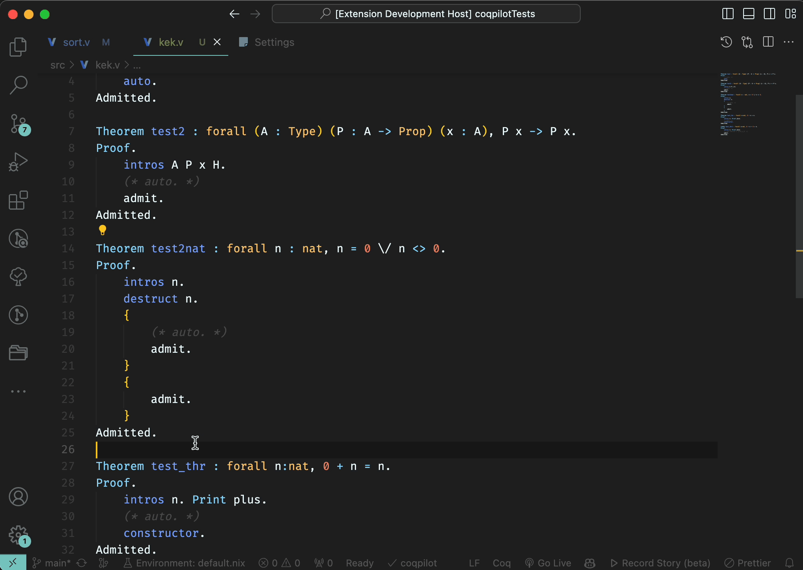

# CoqPilot 

*Authors:* Andrei Kozyrev, Gleb Solovev, Nikita Khramov, and Anton Podkopaev, [Programming Languages and Tools Lab](https://lp.jetbrains.com/research/plt_lab/) at JetBrains Research.

`CoqPilot` is a [Visual Studio Code](https://code.visualstudio.com/) extension that is designed to help automate writing of Coq proofs. It uses Large Language Models to generate multiple potential proofs and then uses [coq-lsp](https://github.com/ejgallego/coq-lsp) to typecheck them. It substitutes the proof in the editor only if a valid proof is found. 

# Table of Contents

- 🚀 [CoqPilot Overview](#coqpilot)
- 📋 [Requirements](#requirements)
- 🔍 [Brief Technical Overview](#brief-technical-overview)
- 💡 [Example Usage](#example-usage)
- 🛠 [Installation](#installation)
  - ▶️ [Coq-LSP Installation](#coq-lsp-installation)
  - 🤖 [Building Locally](#building-locally)
- ⚠️ [Important Information](#important)
- ⚙️ [Extension Settings](#extension-settings)
- 📐 [Guide to Model Configuration](#guide-to-model-configuration)
  - 🎛 [How VSCode settings work](#how-vscode-settings-work)
  - 🧰 [Model Configuration](#model-configuration)
- 📌 [Contributed Commands](#contributed-commands)
- 📊 [Benchmark](#benchmark)
- 🧩 [Integrating other solutions](#integrating-other-solutions)
  - 🧠 [Tactician](#tactician)
  - 🔨 [CoqHammer](#coqhammer)
- 🔜 [Future Plans](#future-plans)
- 📜 [Release Notes](#release-notes)

## Requirements

* `coq-lsp` version `0.2.2+8.19` is currently required to run the extension.

## Brief technical overview

`CoqPilot` fetches proofs from multiple completion services. Now we support: 
- a service that always returns a list of pre-defined in the settings tactics/coq sentances.
- an [OpenAI](https://openai.com) gpt service.
- a service that fetches completions from the model, running locally in LM Studio.
- a service that uses Grazie platform (only for JetBrains employees for now).

For each service, an array of models could be defined through the settings. Each model will be used for generation independantly. This brings freedom to the user to experiment with different model parameters, e.g. temperature, prompt, etc.

When `CoqPilot` completion command is issued, it parses the currently opened file, extracts theorems that have complete proofs and processes them into a message history for the LLM. It helps LLM to keep the style and hallucinate less. 

For each `admit.` present in the file, an independent completion process is issued. If a valid proof is found, it is substituted in the editor. `CoqPilot` also allows a multi-round fixing procedure for the proofs from the LLM. I.e. if the proof was incorrect, compiler message could be automatically sent to the LLM with a request to repair it. It can now be configured in the settings. One can set the number of attempts for the consequtive proof fixing with compiler feedback.

As soon as at least one valid proof is found, it is substituted in the editor and the process is finished.

**Notice:** By default, CoqPilot sets only `PredefinedProofs` and `OpenAI` services. The first one tries `auto.` tactic and the second one has one model -- `gpt-3.5`. By default the `apiKey` for OpenAI is not set, i.e. set to `None`. Do not forget to change that in the settings before using this service.

**Notice:** File `settings.json` declares not all the settings, but those that are overriden from the defaults. Keep that in mind, if you want, for example, to turn off the `OpenAI` service. For that, you would need to override the corresponding setting with an empty array, but not delete this property from the file.

## Example usage

`CoqPilot` only runs on an opened `coq` file. User can:
- Run `CoqPilot` with some chosen selection to try substitute all admits in this selection.



- Run `CoqPilot` to try substitute all admits in the file.
- Run `CoqPilot` to substitute the proof for the admit if there is one under the cursor.

## Installation

### Coq-LSP installation

To run the extension, you must install a `coq-lsp` server. Depending on the system used in your project, you should install it using `opam` or `nix`. A well-configured `nix` project should have the `coq-lsp` server installed as a dependency. To install `coq-lsp` using `opam`, you can use the following commands: 
```bash
opam pin add coq-lsp 0.2.2+8.19
opam install coq-lsp
```
For more information on how to install `coq-lsp` please refer to [coq-lsp](https://github.com/ejgallego/coq-lsp). 

Either way around, if the [coq-lsp](https://github.com/ejgallego/coq-lsp) extension works well and you can see the goals and theorems in the VSCode, then `CoqPilot` should work as well. However, using [coq-lsp](https://github.com/ejgallego/coq-lsp) as a plugin for Coq support is not mandatory for `CoqPilot` to work.

If your installation of `coq-lsp` is not in the default path, you can specify the path to the `coq-lsp` server in the settings using the `coqpilot.coqLspServerPath` setting. Default value should work well for most of the cases.

### Building locally

First, clone the CoqPilot repository and navigate into its directory.
```bash
git clone https://github.com/JetBrains-Research/coqpilot.git
cd coqpilot
```

To build the extension locally, you'll need Node.js installed. The recommended way to manage Node.js versions is by using `nvm`. From the CoqPilot root directory, execute:
```bash
nvm use
```
If you prefer not to use `nvm`, ensure you install the Node.js version specified in the [`.nvmrc`](.nvmrc) file by any other method you prefer.

Once Node.js is installed, the remaining setup will be handled by the `npm` package manager. Run the following commands:
```bash
npm install
npm run compile
```

To run the extension from the VSCode, you can press `F5` or click on `Run extension` in the `Run and Debug` section. It will open a new window with the extension running.

To run all tests properly (i.e. with rebuilding the resources and the code first), execute the following task:
```bash
npm run clean-test
```

To run specific tests, you can use `npm run test -- -g="grep pattern"`.

<!-- ## Architecture

The extension's architecture overview is stored in the [ARCHITECTURE.md](https://github.com/JetBrains-Research/coqpilot/blob/refactor/ARCHITECTURE.md) file. It will be extended and updated as the project evolves. -->

## Important 

CoqPilot generates aux files with `_cp_aux.v` suffix. Sometimes when generation fails with exception, it is possible that such file will not be deleted. When a project is open, extension shall show a window that asks if you want to add such files to the local project gitignore. 

Moreover, this repository contains a script for your convenience that adds the format of such files to the global gitignore file on your system.  
- Copy the [`set_gitignore.sh`](https://github.com/JetBrains-Research/coqpilot/blob/main/set_gitignore.sh) file to your computer. Then: 
```bash 
chmod +x set_gitignore.sh
./set_gitignore.sh
```
It will add the format of CoqPilot aux files to your global gitignore file on the system, so that even if CoqPilot forgets to clean files up, they will not be marked as new files in git.
Comment: Such files are not visible in the VSCode explorer, because plugin adds them to the `files.exclude` setting on startup.

## Extension Settings

This extension contributes the following settings:

* `coqpilot.contextTheoremsRankerType` : The type of theorems ranker that will be used to select theorems for proof generation (when context is smaller than taking all of them). Either randomly, by Jacard index (similarity metric) or by distance from the theorem, with the currently observed admit. 
* `coqpilot.loggingVerbosity` : Verbosity of the logs. Could be `info`, `debug`.
* `coqpilot.coqLspServerPath` : Path to the coq-lsp server. By default, it is set to `coq-lsp`.

* `coqpilot.predefinedProofsModelsParameters`, `coqpilot.openAiModelsParameters`, `coqpilot.grazieModelsParameters` and `coqpilot.lmStudioModelsParameters`:

Each of these settings are modified in `settings.json` and contain an array of models from this service. Each model will be used for generation independantly. Multiple models for a single service could be defined. For example, you can define parameters for two OpenAI gpt models. One would be using `gpt-3.5` and the other one `gpt-4`. CoqPilot will first try to generate proofs using the first model, and if it doesn't succeed, it will try the second one. This way CoqPilot iterates over all services (currently 4 of them) and for each service it iterates over all models. 

## Guide to Model Configuration

### How VSCode settings work

A common way to change the settings, contributed by the extension, is to open the `settings.json` file, or click `Edit in settings.json` on some field in settings UI. Say, by default extension contributes field (setting) `A` with default state `a'`. When you click edit, this field is being copied to the `settings.json` file with the value `a'`: 
```json
{
    "A": "a'"
}
```
From that moment and until you completely remove this field from the `settings.json` file, this will be the source of truth for this setting. Once again, if you want to set the value of the setting `A` back to the default, you have to remove this field from the file completely.

### Model configuration

As mentioned in the previous section, at the moment, four services are supported. 

By default, only `PredefinedProofs` and `OpenAI` services are enabled. The first one tries `auto.` tactic and the second one has one model -- `gpt-3.5`. Models for other services are defaulted with empty arrays. That denotes that we do not create any models from these services. 

Each and every service is configured with an array of independent models. This was made to easily experiment with different models and their parameters. 

The simplest service to configure is `PredefinedProofs`: 
```json
{
    "coqpilot.predefinedProofsModelsParameters": [
        {
            "modelId": "predefined proofs",
            "tactics": [
                "reflexivity.",
                "simpl. reflexivity.",
                "auto."
            ]
        }
    ]
}
```
The `modelId` property may be any string you like, but it should be unique for each model. This way, CoqPilot will be able to correctly tell you which model might have configuration issues.

The most commonly used service is `OpenAI` (`Grazie` and `LmStudio` are configured very similarly). 
```json
{
    "coqpilot.openAiModelsParameters": [
        {
            "modelId": "openai-gpt-3.5",
            "modelName": "gpt-3.5-turbo-0301",
            "temperature": 1,
            "apiKey": "***your-api-key***",
            "choices": 10,
            "systemPrompt": "Generate proof...",
            "maxTokensToGenerate": 2000,
            "tokensLimit": 4096,
            "multiroundProfile": {
                "maxRoundsNumber": 1,
                "proofFixChoices": 1,
                "proofFixPrompt": "Unfortunately, the last proof is not correct..."
            }
        }
    ],
}
```
Don't forget to set up the `apiKey` field, by default it is set to `None`. Moreover, make sure that your OpenAI key is valid and has enough credits to run the models. If you create a free version of the key, it will not work (it has some weird limitations like 5 requests per inf). You can check you key here: https://platform.openai.com/playground/chat. If the playground works, the key is probably valid.

Multi-round profile setting configures the number of attempts to fix the proof if it is incorrect. If the proof is incorrect, the compiler message is sent to the LLM with a request to repair it. The number of round attempts for one proof is set by `maxRoundsNumber`. The number of choices for the proof fixing is set by `proofFixChoices`. By default, values are set to 1 and that means that **NO** attempts to fix the proof are made. That means that proof is only being generated once. That's equivalent to say that multi-round fixing is turned off. 0 is not a valid value for `maxRoundsNumber` nor for `proofFixChoices`.  

Another thing to keep in mind: We are still in beta and changes in settings may occur pretty often. When that happens, and your re-defined settings (which are stored aside from the extension) are not updated (by hand), this can lead to exceptions. Keep in mind that if you get an error or plugin does not start after the update, you may want double check the settings. Easy way is remove the setting completely in `settings.json`, e.g. `openAiModelsParameters`, than go to the UI, click `Edit in settings.json` on the `openAiModelsParameters` field. It will fill up with updated default values. Afterwards you can re-define the settings as you want.

## Contributed Commands

* `coqpilot.perform_completion_under_cursor`: Try to generate proof for the goal under the cursor.
* `coqpilot.perform_completion_for_all_admits`: Try to prove all holes (admitted goals) in the current file.
* `coqpilot.perform_completion_in_selection`: Try to prove holes (admitted goals) in selection. 

## Benchmark

To run benchmarks on some project, apart from installing and building CoqPilot manually as described above, you will need to download the necessary projects that are used as datasets for the benchmarks. These projects are added as submodules to the repository. To download them, run the following commands:
```bash
git submodule init
git submodule update
```
After that, you need to build the projects. Be careful, the actively maintained way to build this projects is `nix`. Moreover, when adding your own projects, make sure that they are built using `coq-8.19.0`.

### New framework (beta)

The new benchmarking framework with extended capabilities is now available. 
However, it is still in the testing phase, so some bugs and missing features may be present.

To use it, follow the instructions in the [`BENCHMARKING_FRAMEWORK_GUIDE.md`](etc/docs/benchmark/BENCHMARKING_FRAMEWORK_GUIDE.md).

### Legacy framework

The process of running the benchmark is not perfectly automated and we are working on it. For now, one project (one unit containing nix environment) shall be ran at a time. Let's say you are going to run the benchmark on the `imm` project. You will have to do the following: 

<!-- 0. Go the the `imm` subdirectory and add a `_CoqProject` file in the root with the following: 
    ```
    -I result/lib/coq/8.19/user-contrib/imm
    -R result/lib/coq/8.19/user-contrib/imm imm
    ```
    This is needed for the lsp-server to correctly resolve file dependencies. -->

1. Install nix, as specified in the [here](https://nixos.org/download.html). 

2. Install needed caches: 
    ```bash
    nix-env -iA nixpkgs.cachix && cachix use coq && cachix use coq-community && cachix use math-comp
    cachix use weakmemory
    ```

3. Go to the `imm` subdirectory, apply the nix environment (without it the project will **NOT** build) and build the project: 
    ```bash
    cd dataset/imm 
    nix-shell 
    make
    ```
4. Make sure the `_CoqProject` was successfully generated in the root of your project. Return to the project root not exiting the nix-shell. Run the benchmark: 
    ```bash
    cd ../../
    npm run benchmark
    ```    

If you aim to run the benchmark with the use of `Tactician`, you should install the `imm` project and `Tactician` with `opam`. For `opam` installation instruction, you can refer to the [Tactician website](https://coq-tactician.github.io/manual/installation/) and [imm repository](https://github.com/weakmemory/imm/tree/master?tab=readme-ov-file#installation-via-opam-supported-up-to-the-15-version-of-imm) (this part of the README file is a little outdated, but the installation process for `coq-8.19.0` is still the same).

## Integrating other solutions

As CoqPilot supports adding predefined commands to try as completion both in the plugin and the benchmark, you can integrate `Coq` generation methods, that contribute a specific tactic and are triggered from OCaml. 

### Tactician

[Tactician](https://coq-tactician.github.io) is a tactic learner and prover for the Coq Proof Assistant. To install: 
```bash
opam pin coq-tactician https://github.com/coq-tactician/coq-tactician.git#coq8.19
opam install coq-tactician
tactician enable
```

To use completion tactics from `Tactician` you need to add an import: 
```coq
From Tactician Require Import Ltac1.
```

After that, add the `synth.` tactic to the predefined tactics in the settings. 

Neural `Graph2Tac` completion unfortunately requires `coq < 8.12~`. 

### CoqHammer

[CoqHammer](https://coqhammer.github.io) is an automated reasoning tool for Coq. To install: 
```bash
opam install coq-hammer
```

To install `CoqHammer` using `nix`, you can use the following command [nix configuration file](https://github.com/vbgl/nixpkgs/tree/coq-coq-hammer).

Import the tactics: 
```coq
From Hammer Require Import Hammer.
```

Then add the `hammer.`, `sauto.` or any other tactic from `CoqHammer` to the predefined tactics in the settings.

## Future plans

- Currently the user needs to manually enter the nix shell to get the correct environment for the benchmarks. We are working on automating this process.
- Get rid of the overhead due to hacks with coq-lsp and the aux files.

## Release Notes

Release notes could be found in the [CHANGELOG.md](https://github.com/JetBrains-Research/coqpilot/blob/main/CHANGELOG.md) file.
