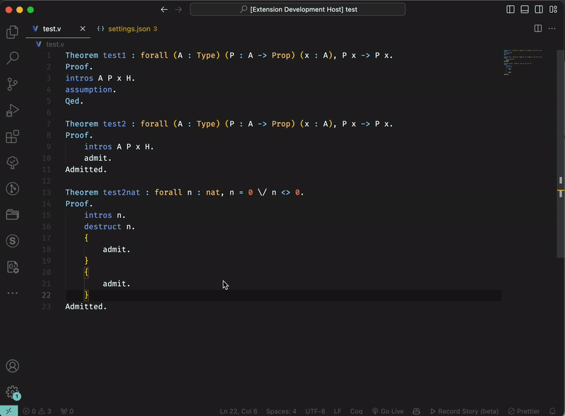

# coqpilot

*Authors:* Andrei Kozyrev, Gleb Solovev and Anton Podkopaev, [Programming Languages and Tools Lab](https://lp.jetbrains.com/research/plt_lab/) at JetBrains Research.

`Coqpilot` is a [Visual Studio Code](https://code.visualstudio.com/) extension that is designed to help automate writing of Coq proofs. It uses Large Language Models to generate multiple potential proofs and then uses [coq-lsp](https://github.com/ejgallego/coq-lsp) to typecheck them. It substitutes the proof in the editor only if a valid proof is found. 

Now `coqpilot` is in early beta and seeks for feedbacks. Please feel free to open an issue regarding any problem you encounter or any feature you want to see in the future. 

## Brief technical overview

`Coqpilot` now supports fetching proofs from all [open-ai](https://openai.com) gpt models, but is designed to be easily extensible to other models.  

## Features

`Coqpilot` could be run to analyse the opened `coq` file, fetch proofs of successfully typechecked theorems inside it, parse them and use as a message history to present to LLM.

It performs a request to an LLM with an admitted theorem and a message history and get a list of potential proofs. It then uses `coq-lsp` to typecheck them and substitute the first valid proof in the editor. Moreover, coqpilot was designed to fetch multiple LLMs, so that many ways of proof generation could be used at once. Right now, apart from open-ai models, coqpilot also tries substituting single-line proofs from the predefined tactics list.

User can:
- Run `coqpilot` with some chosen selection to try substitute all admits in this selection.



- Run `coqpilot` to try substitute all admits in the file.

## Requirements

* `coq-lsp` version 0.1.8 is currently required to run the extension.

## Coq-lsp installation

To make the extension running you will have to install `coq-lsp` server. You can install it using opam: 
```bash
opam install coq-lsp
```
For more information on how to install `coq-lsp` please refer to [coq-lsp](https://github.com/ejgallego/coq-lsp). 

## Important 

Coqpilot generates aux files with `_cp_aux.v` suffix. Sometimes when generation fails with exception, it is possible that such file will not be deleted. When a project is open, extension shall show a window that asks if you want to add such files to the local project gitignore. 

Moreover, this repository contains a script for your convenience that adds the format of such files to the global gitignore file on your system.  
- Copy the [`set_gitignore.sh`](https://github.com/K-dizzled/coqpilot/blob/main/set_gitignore.sh) file to your computer. Then: 
```bash 
chmod +x set_gitignore.sh
./set_gitignore.sh
```
It will add the format of coqpilot aux files to your global gitignore file on the system, so that even if coqpilot forgets to clean files up, they will not be marked as new files in git.
Comment: Such files are not visible in the vscode explorer, because plugin adds them to the `files.exclude` setting on startup.

## Extension Settings

This extension contributes the following settings:

* `coqpilot.openAiModelsParameters`, `coqpilot.predefinedProofsModelsParameters` and `coqpilot.grazieModelsParameters`. 

Each of these settings are modified in `settings.json` and contain an array of models from this service. Each model will be used for generation independantly. Multiple models for a single service could be defined. For example, you can define parameters for two open-ai gpt models. One would be using `gpt-3.5` and the other one `gpt-4`. CoqPilot will first try to generate proofs using the first model, and if it fails, it will try the second one. This way coqpilot iterates over all services (currently 3 of them) and for each service it iterates over all models.

Here are parameters each of the service contributes:

### Open-ai Service Parameters

* `coqpilot.openAiModelsParameters.prompt`: System prompt for the `open-ai` model.
* `coqpilot.openAiModelsParameters.apiKey`: An `open-ai` api key. Is used to communicate with the open-ai api. You can get one [here](https://platform.openai.com/account/api-keys). It is required to run the extension.
* `coqpilot.openAiModelsParameters.choices`: How many proof attempts should be generated for one theorem.
* `coqpilot.openAiModelsParameters.model`: Which `open-ai` model should be used to generate proofs.
* `coqpilot.openAiModelsParameters.maxTokens`: What is your token per minute limit for `open-ai` api. It is used to calculate how many proofs could be used as a message history. For more information please refer to [open-ai](https://platform.openai.com/account/rate-limits). 
* `coqpilot.openAiModelsParameters.temperature`: How much randomness should be added to the generated proofs. The higher the temperature, the more random the generated proofs will be.

### Predefined Proofs Service Parameters

* `coqpilot.predefinedProofsModelsParameters.tactics`: An array of tactics that will be used to generate proofs. For example `["auto."]`. This service is tried at the very beginning of the proof generation process.

### Grazie Service Parameters

* `coqpilot.grazieModelsParameters.prompt`: System prompt for the models. 
* `coqpilot.grazieModelsParameters.apiKey`: An `grazie` api key. Is used to communicate with the grazie api. 
* `coqpilot.grazieModelsParameters.choices`: How many proof attempts should be generated for one theorem.
* `coqpilot.grazieModelsParameters.model`: Which model should be used to generate proofs.


## Contributed Commands

* `coqpilot.perform_completion_under_cursor`: Try to generate proof for the goal under the cursor.
* `coqpilot.perform_completion_for_all_admits`: Try to prove all holes (admitted goals) in the current file.
* `coqpilot.perform_completion_in_selection`: Try to prove holes (admitted goals) in selection.

## Planned Features

- Add banchmarking options for various models: soon. 

## Release Notes

Release notes could be found in the [CHANGELOG.md](https://github.com/JetBrains-Research/coqpilot/blob/refactor/CHANGELOG.md) file.
